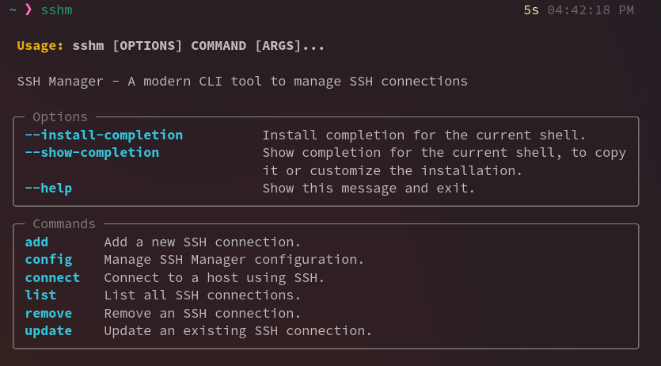

# SSH Manager (sshm)

A modern command-line tool to manage your SSH connections with style. Easily manage your SSH config file with a beautiful interface.



[](https://pypi.org/project/sshm/)
[](https://pypi.org/project/sshm/)
[](https://github.com/palace22/sshm/blob/main/LICENSE)
[](https://github.com/palace22/sshm/actions)

## Features

- 🚀 **Simple and intuitive CLI interface**
- 📝 **List all SSH connections** in a beautiful table format
- ➕ **Add new SSH connections** interactively or via command line
- 🔄 **Update existing connections** with ease
- 🗑️ **Remove connections** safely with confirmation
- 🔌 **Connect to hosts** using simple aliases
- 🔐 **Automatic backup** of SSH config file
- 📊 **Beautiful terminal UI** using Rich
- 🔍 **Search and filter** connections
- 🧪 **Test SSH connectivity** before connecting
- ⚙️ **Configurable settings** and preferences
- 📤 **Export/Import** connections
- 🛡️ **Input validation** and error handling

## Installation

### Quick Install (Recommended)

```bash
# One-liner installation
curl -sSL https://raw.githubusercontent.com/palace22/sshm/main/install.sh | bash
```

### Manual Installation Options

#### 1. From GitHub (Latest)

```bash
pip install --user git+https://github.com/palace22/sshm.git
```

#### 4. Development Installation

```bash
git clone https://github.com/palace22/sshm.git
cd sshm
pip install --user -e ".[dev]"
```

### Post-Installation Setup

If the `sshm` command is not found after installation, add `~/.local/bin` to your PATH:

```bash
# For Zsh users
echo 'export PATH="$PATH:$HOME/.local/bin"' >> ~/.zshrc
source ~/.zshrc

# For Bash users
echo 'export PATH="$PATH:$HOME/.local/bin"' >> ~/.bashrc
source ~/.bashrc
```

### Verification

```bash
sshm --help
```

## Quick Start

```bash
# List all connections
sshm list

# Add a new connection (interactive)
sshm add

# Add a connection via command line
sshm add --name myserver --hostname example.com --user myuser --port 2222

# Connect to a host
sshm connect myserver

# Update a connection
sshm update myserver --hostname new-example.com

# Remove a connection
sshm remove myserver

# Test a connection
sshm test myserver

# Search connections
sshm list --search web

# Show detailed view
sshm list --detailed
```

sshm list --format json # Output in JSON format
sshm list --search prod # Search for connections containing 'prod'

````

### Add Connection

```bash
sshm add  # Interactive mode
sshm add --name myserver --host example.com --user admin --port 22  # Direct mode
````

### Update Connection

```bash
sshm update myserver  # Interactive mode
sshm update myserver --host new-example.com  # Update specific fields
```

### Remove Connection

```bash
sshm remove myserver  # With confirmation
sshm remove myserver --force  # Force remove without confirmation
```

### Connect

```bash
sshm connect myserver  # Connect to a server using its alias
sshm connect myserver --dry-run  # Show the SSH command without executing
```

## SSH Config Format

The tool manages connections in your SSH config file (`~/.ssh/config`). Each entry follows this format:

```
Host myserver
    HostName example.com
    User admin
    Port 22
    IdentityFile ~/.ssh/id_rsa
    # Additional SSH options...
```

## Configuration

SSH Manager respects your existing SSH config file and makes safe modifications. Configuration options:

```bash
# Set default SSH key
sshm config set default_key ~/.ssh/id_rsa

# Set backup directory
sshm config set backup_dir ~/.ssh/backups

# Enable/disable automatic backups
sshm config set auto_backup true
```

## Development

### Setup Development Environment

```bash
# Clone the repository
git clone https://github.com/yourusername/ssh-manager
cd ssh-manager

# Install poetry
curl -sSL https://install.python-poetry.org | python3 -

# Install dependencies
poetry install

# Setup pre-commit hooks
poetry run pre-commit install
```

### Running Tests

```bash
poetry run pytest
```

### Code Style

This project uses:

- Black for code formatting
- isort for import sorting
- mypy for type checking
- pre-commit hooks to enforce quality

## Contributing

Contributions are welcome! Please feel free to submit a Pull Request.

1. Fork the repository
2. Create your feature branch (`git checkout -b feature/AmazingFeature`)
3. Commit your changes (`git commit -m 'Add some AmazingFeature'`)
4. Push to the branch (`git push origin feature/AmazingFeature`)
5. Open a Pull Request

## License

This project is licensed under the GPL-3.0 License - see the [LICENSE](LICENSE) file for details.

## Acknowledgments

- [Typer](https://typer.tiangolo.com/) for the CLI interface
- [Rich](https://rich.readthedocs.io/) for beautiful terminal formatting
- [paramiko](http://www.paramiko.org/) for SSH functionality
